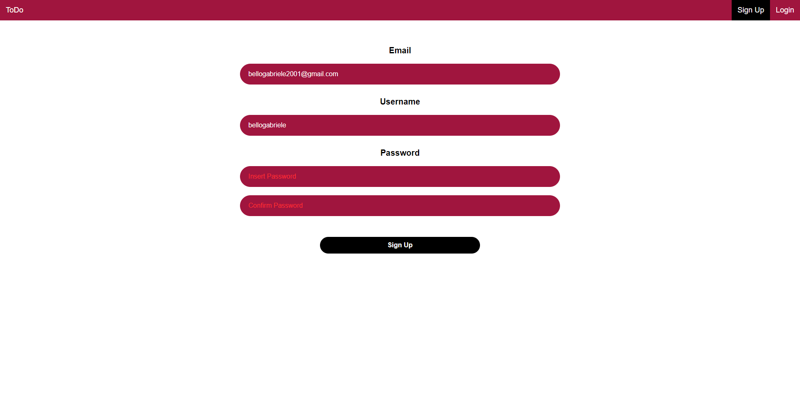
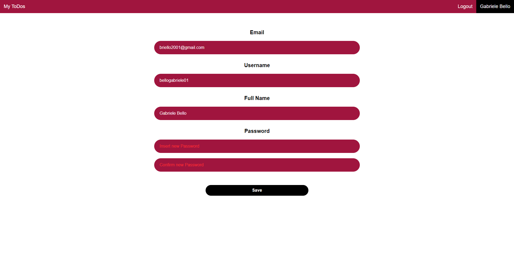
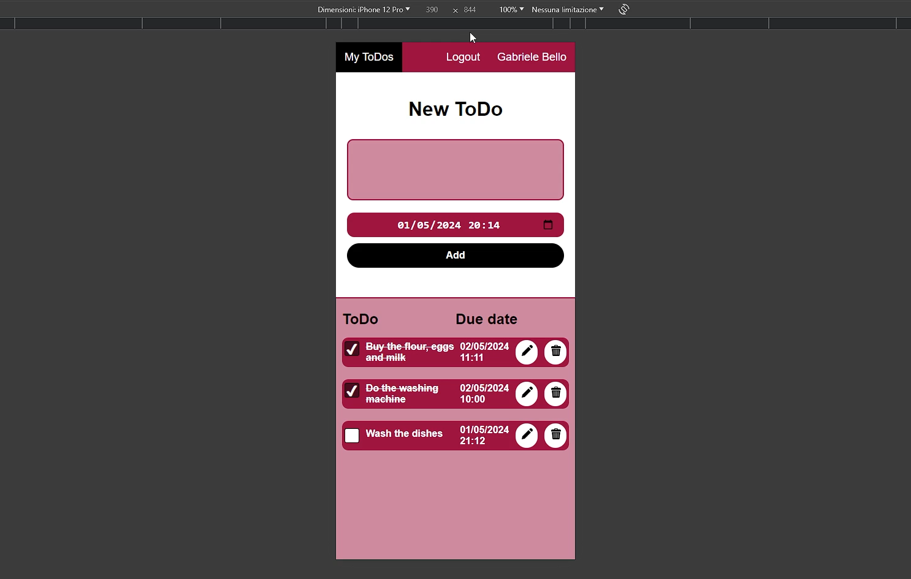

# ToDo
## Flask Web Application
### Video Demo:  https://youtu.be/s0PbrR0riQU
### Description:
ToDo, a user-friendly web app crafted with Python and Flask framework, sprinkled with just the right touch of JavaScript. Create your personalized account and effortlessly manage your tasks with ease.

## Usage w/Screenshots

ToDo lets you create your own account through a secure signing up and login.

Once you're logged in you can navigate to the "My ToDos" interface to create, check, edit and delete your ToDos.

You can also access to your account section and modify/add new information to your profile.

ToDo has support for all screen sizes!

## Technologies Used
- Python
- Flask
- JavaScript
- HTML
- CSS

## Features
- User authentication and authorization
- CRUD operations on ToDos
- Responsive design for all screen sizes
