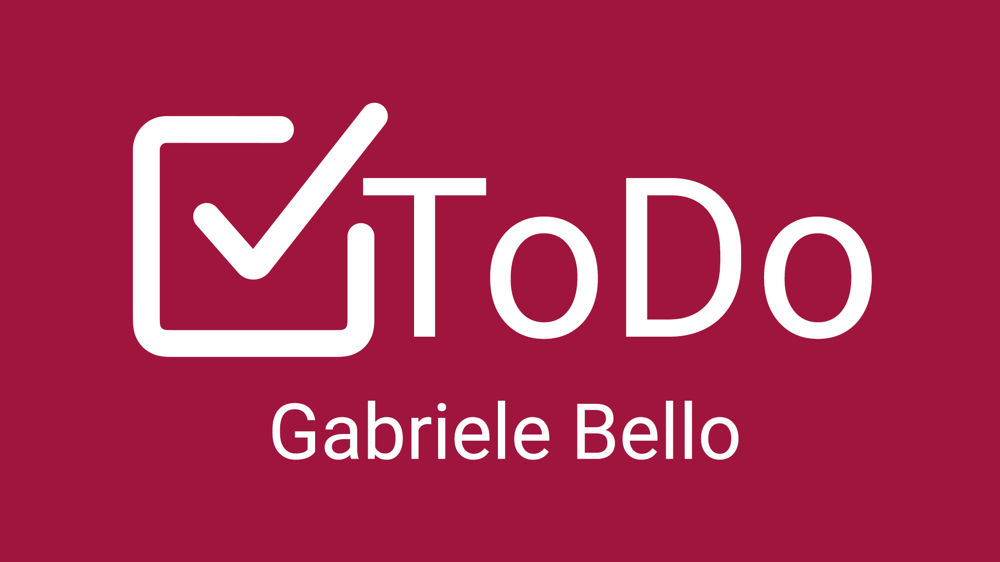
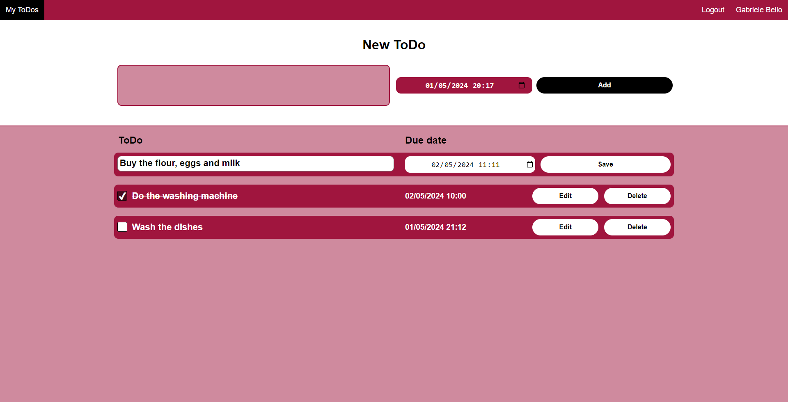

# ToDo - Flask Web Application
### Video Demo:  https://youtu.be/s0PbrR0riQU

## Basic overview
ToDo, a user-friendly web app crafted with Python and Flask framework, sprinkled with just the right touch of JavaScript.
Create your personalized account and effortlessly manage your tasks with ease.

## Key Features
- User authentication and authorization
- CRUD operations on ToDos
- Account personalization
- Responsive design for all screen sizes

## Technologies Used
- Python
- Flask
- JavaScript
- HTML
- CSS
